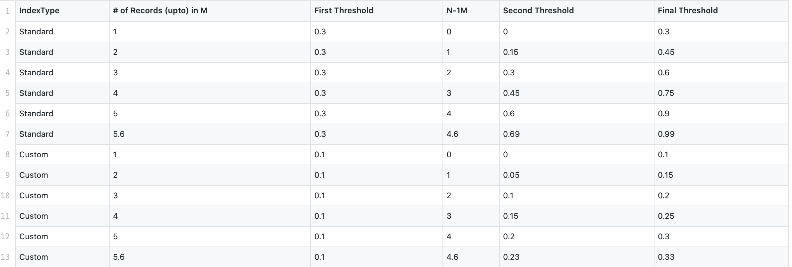

## How to use DX plugin for getting the query plan ?

- Requires 0.0.46 version of the plugin
    - sfdx-mohanc-plugins@0.0.46
    - [How to install the plugin](https://mohan-chinnappan-n.github.io/dx/plugins.html#/1)


```
$ sfdx mohanc:data:queryPlan -h
Execute Query Plan for the given SOQL Query

USAGE
  $ sfdx mohanc:data:queryPlan

OPTIONS
  -q, --queryfilename=queryfilename                Input file having SOQL query
  -u, --targetusername=targetusername              username or alias for the target org; overrides default target org
  -v, --targetdevhubusername=targetdevhubusername  username or alias for the dev hub org; overrides default dev hub org
  --apiversion=apiversion                          override the api version used for api requests made by this command
  --json                                           format output as json
  --loglevel=(trace|debug|info|warn|error|fatal)   logging level for this command invocation

EXAMPLE


       ** Execute Query Plan for the given SOQL Query **
      $ sfdx mohanc:data:queryPlan -q /tmp/qp.soql  -u mohan.chinnappan.n_ea2@gmail.com
```

### Query file

``` 
$ cat /tmp/qp.soql 
SELECT Id 
 FROM Account 
 LIMIT 10

```
### Query Results
```
$ sfdx mohanc:data:query -q /tmp/qp.soql  -u mohan.chinnappan.n_ea2@gmail.com
```
```
"attributes","Id"
"{""type"":""Account"",""url"":""/services/data/v50.0/sobjects/Account/0013h00000FffwFAAR""}","0013h00000FffwFAAR"
"{""type"":""Account"",""url"":""/services/data/v50.0/sobjects/Account/0013h00000FffwGAAR""}","0013h00000FffwGAAR"
"{""type"":""Account"",""url"":""/services/data/v50.0/sobjects/Account/0013h00000FffwHAAR""}","0013h00000FffwHAAR"
"{""type"":""Account"",""url"":""/services/data/v50.0/sobjects/Account/0013h00000FffwIAAR""}","0013h00000FffwIAAR"
"{""type"":""Account"",""url"":""/services/data/v50.0/sobjects/Account/0013h00000FffwJAAR""}","0013h00000FffwJAAR"
"{""type"":""Account"",""url"":""/services/data/v50.0/sobjects/Account/0013h00000FffwKAAR""}","0013h00000FffwKAAR"
"{""type"":""Account"",""url"":""/services/data/v50.0/sobjects/Account/0013h00000FffwLAAR""}","0013h00000FffwLAAR"
"{""type"":""Account"",""url"":""/services/data/v50.0/sobjects/Account/0013h00000FffwMAAR""}","0013h00000FffwMAAR"
"{""type"":""Account"",""url"":""/services/data/v50.0/sobjects/Account/0013h00000FffwNAAR""}","0013h00000FffwNAAR"
"{""type"":""Account"",""url"":""/services/data/v50.0/sobjects/Account/0013h00000FffwOAAR""}","0013h00000FffwOAAR"

```
### Query Plan
```
  $ sfdx mohanc:data:queryPlan -q /tmp/qp.soql  -u mohan.chinnappan.n_ea2@gmail.com

```

```json
{
    "plans": [
        {
            "cardinality": 10,
            "fields": [],
            "leadingOperationType": "Other",
            "notes": [
                {
                    "description": "Not considering filter for optimization because unindexed",
                    "fields": [
                        "IsDeleted"
                    ],
                    "tableEnumOrId": "Account"
                }
            ],
            "relativeCost": 0.03333333333333333,
            "sobjectCardinality": 1001,
            "sobjectType": "Account"
        },
        {
            "cardinality": 501,
            "fields": [],
            "leadingOperationType": "TableScan",
            "notes": [
                {
                    "description": "Not considering filter for optimization because unindexed",
                    "fields": [
                        "IsDeleted"
                    ],
                    "tableEnumOrId": "Account"
                }
            ],
            "relativeCost": 1.7521666666666669,
            "sobjectCardinality": 1001,
            "sobjectType": "Account"
        }
    ],
    "sourceQuery": "SELECT Id \n FROM Account \n LIMIT 10"
}
```

## Fields having indexes
- Standard fields having index
    - Primary Key
        - Id
        - Name
        - OwnerId
    - Foreign Key
        - CreatedById
        - LastModifiedById
        - lookup
        - master-detail relationship
    - Audit fields
        - CreatedDate
        - SystemModstamp
    - Email
- Custom fields
    - If they are marked as Unique or External Id

## Filter
- If the filter doesn't have an index, 
    - it won't be considered for optimization.
- If the filter has an index, 
    - determine how many records it would return:

## Query Optimizer
- To determine if an index should be used to drive a query, the Force.com query optimizer checks the **number of records targeted by the filter** against **selectivity thresholds**

## Cheat sheets

- [Query & Search Optimization Cheat Sheet](qp/salesforce_query_search_optimization_developer_cheatsheet.pdf)
- [Query Index Thresholds Spreadsheet](qp/std-threshold.csv)
- 30/15 for Standard Index Fields and 10/5 for Custom Index Fields
- Force.com query optimizer will use the standard and custom indexes to drive the query:
    -  when number of targeted records falls below the appropriate selectivity threshold. 
- Force.com query optimizer will NOT use the standard and custom indexes to drive the query:
    -   when the number of targeted records exceeds an **index’s selectivity threshold**
- A LIKE condition with a leading % wildcard does not use an index.
- When your filter uses != or NOT—which includes using NOT EQUALS/CONTAINS for reports, even if the field is indexed—the Force.com query optimizer can’t use the index to drive the query. 
    - For better performance, filter using = or IN, and the reciprocal values.

### Key Points
- Understand your schema and have proper indexes created.
- Apply as many filters as possible to reduce the result set.
- Minimize the amount of records in the Recycle Bin.
- Remember that NOT operations and LIKE conditions with a leading % wildcard do not use indexes, and complex joins might perform better as separate queries.


- 
- 

## References
- [Query Plan FAQ](https://help.salesforce.com/articleView?id=000334796&type=1&mode=1)
- [Make SOQL query selective](https://help.salesforce.com/articleView?id=000325257&type=1&mode=1)
- [Slides: Inside the Force.com Query Optimizer](https://www.slideshare.net/developerforce/inside-the-forcecom-query-optimizer-webinar)
- [Video: SOQL Query Performance Tips and Tricks](https://www.youtube.com/watch?v=uyyXdEIieN4)
