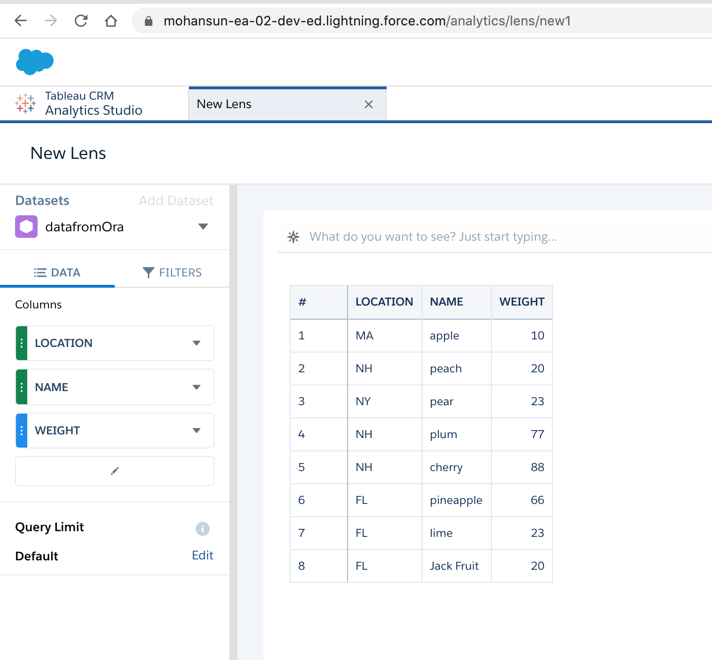

# Loading Oracle SQL Query Results into EA Dataset
- Requires 0.0.127 version of the plugin
    - sfdx-mohanc-plugins@0.0.127
    - [How to install the plugin](https://mohan-chinnappan-n.github.io/dx/plugins.html#/1)


## Usage
```
$ sfdx mohanc:ea:dataset:loadFromOra -h
Dataset Loader for EA from Oracle Query  

USAGE
  $ sfdx mohanc:ea:dataset:loadFromOra

OPTIONS
  -a, --datasetname=datasetname                   Dataset Name
  -c, --chunksize=chunksize                       Chunk size in number of records default: 10000 records
  -f, --dimfields=dimfields                       Dimension Field Names in CSV
  -l, --oraconnfilename=oraconnfilename           Oracle DB connection JSON file
  -m, --mulvalfields=mulvalfields                 Multi Value Field Names in CSV
  -o, --operation=operation                       Operation to perform : Overwrite|Append|Upsert|Delete
  -q, --sqlfilename=sqlfilename                   Input file having SQL query
  -s, --mulvalsep=mulvalsep                       multiValue separator: default ','
  -u, --targetusername=targetusername             username or alias for the target org; overrides default target org
  --apiversion=apiversion                         override the api version used for api requests made by this command
  --json                                          format output as json
  --loglevel=(trace|debug|info|warn|error|fatal)  logging level for this command invocation

EXAMPLE

              Loads from given SQL Query results from Oracle DB to EA dataset

              sfdx mohanc:ea:dataset:loadFromOra
               -u <username> 
               -o operation (Overwrite|Append|Upsert|Delete)
               -m <multiValueFields as CSV> -s <multiValue separator: default ','>
               -f <DimFields as CSV>
               -c <Chunk Size in number of records, default: 10000, make sure to give this less than the total rows>
               -a <Dataset Name>

               -l <ORA connection JSON file> (note: l is selected to honor Larry Ellison!)
               -q <SQL query File>


             NOTE: If you are using proxy: set the environment variable like this:
             export HTTPS_PROXY=https://your.proxy:proxyPort


```
## Query and connection files

```
$ cat ~/.sql/fruitsall.sql
SELECT * FROM fruits
```
```
$ cat   ~/.sql/ora.json
{
    "user"          : "username",
    "password"      : "password",
    "connectString" : "localhost:1521/xe"
}
```
```
SQL> select banner from v$version;

BANNER
--------------------------------------------------------------------------------
Oracle Database 12c Standard Edition Release 12.1.0.2.0 - 64bit Production
PL/SQL Release 12.1.0.2.0 - Production
CORE	12.1.0.2.0	Production
TNS for Linux: Version 12.1.0.2.0 - Production
NLSRTL Version 12.1.0.2.0 - Production

SQL> 
SQL> select count(*) from fruits;

  COUNT(*)
----------
	 7

SQL> SELECT name, location FROM fruits;

NAME				 LOCATION
-------------------------------- --------------------------------
apple				 MA
peach				 NH
pear				 NY
plum				 NH
cherry				 NH
pineapple			 FL
lime				 FL

7 rows selected.

````
## Demo 
```
$ sfdx mohanc:ea:dataset:loadFromOra -u mohan.chinnappan.n_ea2@gmail.com  -q ~/.sql/fruitsall.sql -l ~/.sql/ora.json -a datafromOra -c 6 
=== Finding the data types based on the sample data ...
[ 'NAME', 'LOCATION', 'WEIGHT' ]
[ 'apple', 'MA', 10.200000000000001 ]
[
  {
    fullyQualifiedName: 'datafromOra.NAME',
    label: 'NAME',
    name: 'NAME',
    isSystemField: false,
    isUniqueId: false,
    isMultiValue: false,
    multiValueSeparator: 'null',
    type: 'Text'
  },
  {
    fullyQualifiedName: 'datafromOra.LOCATION',
    label: 'LOCATION',
    name: 'LOCATION',
    isSystemField: false,
    isUniqueId: false,
    isMultiValue: false,
    multiValueSeparator: 'null',
    type: 'Text'
  },
  {
    fullyQualifiedName: 'datafromOra.WEIGHT',
    label: 'WEIGHT',
    name: 'WEIGHT',
    isSystemField: false,
    isUniqueId: false,
    type: 'Numeric',
    defaultValue: '0',
    precision: 18,
    scale: 4
  }
]
{ id: '06V3h0000005yBrEAI', success: true, errors: [] }
==== Chunk 1 of Chunk Size: 6 records ==== 
==== Last Chunk ====

Done.
Time taken: 40.679 seconds


```

## Job


### Another example

```

SQL> SELECT name, location, Weight FROM fruits; 

NAME				 LOCATION			      WEIGHT
-------------------------------- -------------------------------- ----------
apple				 MA					10.2
peach				 NH					20.3
pear				 NY				       23.42
plum				 NH				       77.33
cherry				 NH				       88.23
pineapple			 FL				       66.32
lime				 FL				       23.45
Jack Fruit			 FL					20.3

8 rows selected.


```


```
$  sfdx mohanc:ea:dataset:loadFromOra -u mohan.chinnappan.n_ea2@gmail.com  -q ~/.sql/fruitsall.sql -l ~/.sql/ora.json -a datafromOra -c 6 
=== Finding the data types based on the sample data ...
[ 'NAME', 'LOCATION', 'WEIGHT' ]
[ 'apple', 'MA', 10.200000000000001 ]
[
  {
    fullyQualifiedName: 'datafromOra.NAME',
    label: 'NAME',
    name: 'NAME',
    isSystemField: false,
    isUniqueId: false,
    isMultiValue: false,
    multiValueSeparator: 'null',
    type: 'Text'
  },
  {
    fullyQualifiedName: 'datafromOra.LOCATION',
    label: 'LOCATION',
    name: 'LOCATION',
    isSystemField: false,
    isUniqueId: false,
    isMultiValue: false,
    multiValueSeparator: 'null',
    type: 'Text'
  },
  {
    fullyQualifiedName: 'datafromOra.WEIGHT',
    label: 'WEIGHT',
    name: 'WEIGHT',
    isSystemField: false,
    isUniqueId: false,
    type: 'Numeric',
    defaultValue: '0',
    precision: 18,
    scale: 4
  }
]
{ id: '06V3h0000006NDTEA2', success: true, errors: [] }
==== Chunk 1 of Chunk Size: 6 records ==== 
==== Last Chunk ====

Done.
Time taken: 30.616 seconds
open https://mohansun-ea-02-dev-ed.my.salesforce.com/analytics/dataManager
 in a web browser to view this job

```



