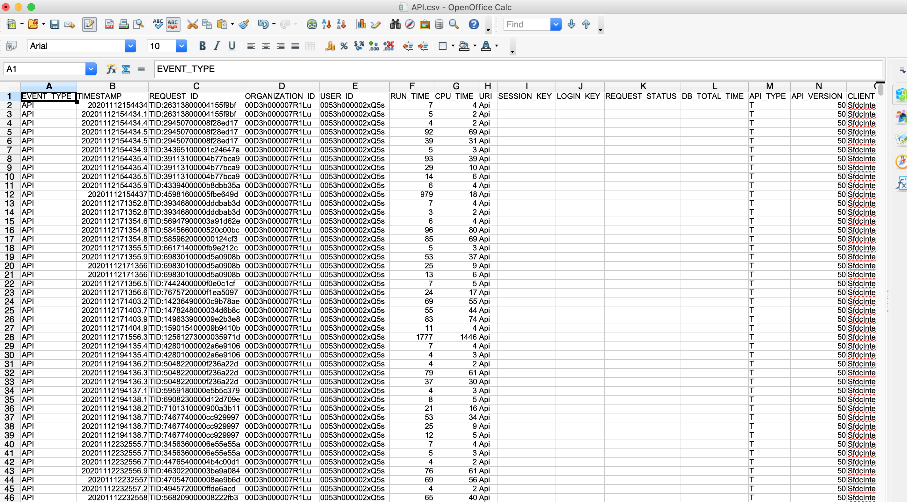
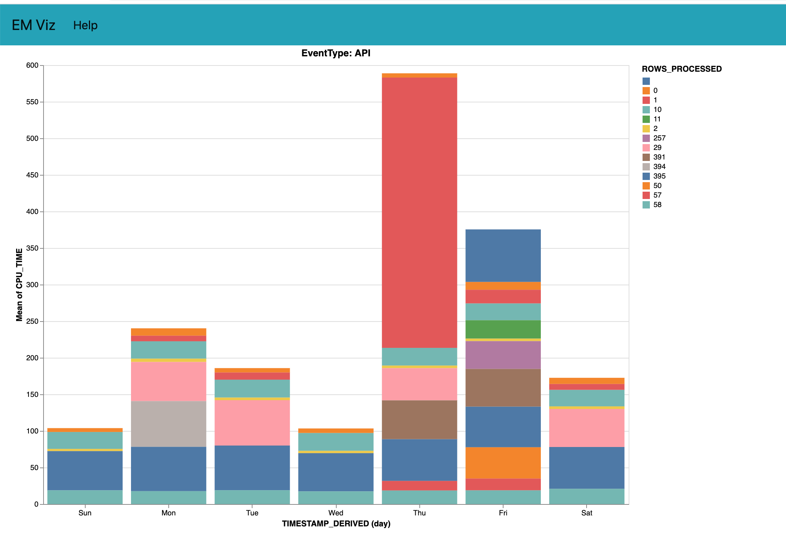

# Viewing and Visualizing Event Log files using DX

## Topics
- [Listing Event Types](#types)
- [Get the log files](#get)
- [Charts](#charts)


<a name="types"></a>
## Listing the Event Types
- Requires 0.0.115 version of the plugin
    - sfdx-mohanc-plugins@0.0.115
    - [How to install the plugin](https://mohan-chinnappan-n.github.io/dx/plugins.html#/1)
### Usage
```
USAGE
  $ sfdx mohanc:monitoring:em:types

OPTIONS
  -u, --targetusername=targetusername              username or alias for the target org; overrides default target org
  -v, --targetdevhubusername=targetdevhubusername  username or alias for the dev hub org; overrides default dev hub org
  --apiversion=apiversion                          override the api version used for api requests made by this command
  --json                                           format output as json
  --loglevel=(trace|debug|info|warn|error|fatal)   logging level for this command invocation

EXAMPLE

       ** Show Event Types   **
       sfdx mohanc:monitoring:em:types -u <userName>

```

### Demo
```
$ sfdx mohanc:monitoring:em:types  -u mohan.chinnappan.n_ea2@gmail.com 
API
ApexExecution
ApexTrigger
BulkApi
ContentTransfer
DocumentAttachmentDownloads
LightningInteraction
LightningPageView
LightningPerformance
Login
Logout
RestApi
URI
WaveChange
WaveInteraction
WavePerformance

```
<a name="get"></a>
## Get the Event files for given Event Type

### Usage
```
$ sfdx mohanc:monitoring:em:get -h
Event Files for the given Event Type 

USAGE
  $ sfdx mohanc:monitoring:em:get

OPTIONS
  -e, --enddate=enddate                            End DateTime for the logs in the format YYYY-MM-DDThh:mm:ssZ,, example: 
                                                   2012-12-30:23:00:00Z

  -o, --eventfileout=eventfileout                  Output CSV file name to write the events into

  -s, --startdate=startdate                        Start DateTime for the logs in the format YYYY-MM-DDThh:mm:ssZ, example: 
                                                   2012-12-30T00:10:00Z

  -t, --eventtype=eventtype                        Event Type for which Event File is requested

  -u, --targetusername=targetusername              username or alias for the target org; overrides default target org

  -v, --targetdevhubusername=targetdevhubusername  username or alias for the dev hub org; overrides default dev hub org

  --apiversion=apiversion                          override the api version used for api requests made by this command

  --json                                           format output as json

  --loglevel=(trace|debug|info|warn|error|fatal)   logging level for this command invocation

EXAMPLE

       ** Event Files for the given Event Type  **
       sfdx mohanc:monitoring:em:get -u <userName> -t <eventType> -o <outFileName> -s <startDateTime> -e <endDateTime>

```

### Demo
```
$ sfdx mohanc:monitoring:em:get -t API  -u mohan.chinnappan.n_ea2@gmail.com -o API2d.csv -s 2020-11-10T00:01:00Z -e 2020-11-13T00:02:00Z
=== Deleting old output file API2d.csv ...
=== Collecting logs for the EventType: API ...
=== Getting log file for LogDate: 2020-11-11T00:00:00.000+0000 of Size: 15113, Total: 15113 Bytes ...
=== Getting log file for LogDate: 2020-11-10T00:00:00.000+0000 of Size: 5590, Total: 20703 Bytes ...
=== Getting log file for LogDate: 2020-11-08T00:00:00.000+0000 of Size: 16036, Total: 36739 Bytes ...
=== Getting log file for LogDate: 2020-11-09T00:00:00.000+0000 of Size: 4159, Total: 40898 Bytes ...
Total Bytes written: 40898 

=== Opening API2d.csv ...
```



<a name="charts"></a>
### Charts
```
$ sfdx mohanc:data:viz:barChart  -d ./API2d.csv -e ./API.csv.encoding-2.json -m bar -o ./APIbarchart.html -p ./apiChart.json

=== Opening ./APIbarchart.html via Local Web Server on port :7020 ...

```


